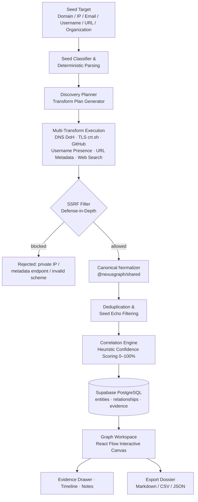

# NexusGraph — OSINT Investigation Graph & Footprint Correlation Platform

-blue)


-3ecf8e)


> **NexusGraph** adalah platform investigasi OSINT (Open Source Intelligence) berbasis web yang mengumpulkan jejak digital publik dari sebuah *seed target*, menormalkannya menjadi entitas kanonikal, menghubungkannya secara otomatis menggunakan algoritma korelasi heuristik dengan *confidence scoring*, dan memvisualisasikannya ke dalam graf interaktif.

Dirancang untuk security researchers, SOC analysts, fraud investigators, dan praktisi defensive cybersecurity.

---

## 1. Deskripsi & Arsitektur Alur Data

NexusGraph mengubah jejak digital publik yang terfragmentasi menjadi graf relasi interaktif yang dapat dijelaskan (*explainable*). Setiap data yang masuk melewati pipeline ketat: validasi, proteksi SSRF, normalisasi kanonikal, korelasi heuristik, hingga penyimpanan dengan *provenance* penuh.



Alur teks singkat:

```
Seed → Collectors → SSRF Filter → Normalizer → Correlation → Graph Workspace → Export
```

---

## 2. Daftar Fitur Lengkap

### 2.1 Case Management
- Buat, edit, arsipkan, tag, dan kelola investigasi dengan isolasi pengguna yang ketat melalui PostgreSQL Row Level Security (`investigations.owner_id = auth.uid()`).

### 2.2 Interactive Graph Workspace
- Canvas **React Flow** (`@xyflow/react`) dengan custom `EntityNode` dan `RelationshipEdge`.
- Minimap, toolbar, zoom/pan, dan tiga algoritma layout: **Force-directed**, **Hierarchical**, dan **Radial**.
- Pemilihan node/edge aktif via Zustand store.

### 2.3 Multi-Transform Discovery Engine
- Menerima seed target: `DOMAIN`, `IP_ADDRESS`, `EMAIL`, `USERNAME`, `URL`, `ORGANIZATION`, `SOCIAL_PROFILE`.
- *Deterministic seed parsing*: entity awal dibuat dengan initial confidence 30%, plus derivasi deterministik (misal URL/Email → Domain).
- Transform berjalan paralel/sekuensial sesuai rencana tanpa fake data:
  - **DNS Collector** — resolusi publik A, AAAA, MX, NS, CNAME, TXT via DNS-over-HTTPS (DoH).
  - **TLS Certificate Collector** — Certificate Transparency (crt.sh), SAN discovery, issuer mapping.
  - **GitHub Public Collector** — repositori publik, bahasa, tautan organisasi, metadata profil.
  - **GitLab Collector** — proyek dan profil publik GitLab.
  - **YouTube Collector** — metadata kanal/publik YouTube.
  - **Username Presence Collector** — cek keberadaan handle di allowlist platform via HEAD request non-intrusif.
  - **URL Metadata Collector** — status code, judul, security headers, redirect chain.
  - **Web Search Collector** — penemuan indikator tambahan dari hasil pencarian publik.
- *Seed echo filtering* untuk mencegah kontaminasi dari entitas yang identik dengan seed itu sendiri.

### 2.4 SSRF Defense-in-Depth
Setiap outgoing HTTP request wajib melewati guard SSRF (`apps/api/src/security/ssrf.ts`):
- Validasi skema URL ketat (hanya HTTP/HTTPS).
- Resolusi DNS **sebelum** fetch; blokir loopback (`127.0.0.0/8`), private IPv4 (`10.0.0.0/8`, `172.16.0.0/12`, `192.168.0.0/16`), IPv6 link-local/ULA.
- Blokir Cloud Metadata Endpoints (AWS IMDS `169.254.169.254`, GCP, Azure, Alibaba).
- Validasi setiap redirect hop, pembatasan ukuran response body (maks 5 MB), dan timeout ketat.

### 2.5 Correlation & Explainability Engine
- Skoring heuristik hubungan antar entitas (0–100%) dengan alasan transparan, contoh: *Exact email match*, *DNS A record resolution*, *TLS SAN mapping*.

### 2.6 Seed Subgraph Cascade Deletion
- Menghapus seed target beserta seluruh subgraf terhubung via **BFS graph traversal**, tanpa merusak klaster seed lain yang independen dalam investigasi yang sama.

### 2.7 Evidence Drawer & Provenance Tracking
- Setiap edge dan entitas merekam URL sumber, cuplikan response (*snippet*), timestamp koleksi, dan nama collector.

### 2.8 Timeline & Analyst Notes
- Timeline kronologis observasi investigasi dan catatan analis berformat Markdown.

### 2.9 Multi-Format Export Dossier
- Export laporan lengkap dalam format **Markdown Dossier**, **CSV Spreadsheet**, atau **JSON dump**.

---

## 3. Tech Stack

| Layer | Teknologi |
|---|---|
| Monorepo | pnpm workspaces |
| Frontend | React 19 + TypeScript + Vite |
| Graf | `@xyflow/react` (React Flow) |
| Server State | TanStack Query (React Query) |
| Client State | Zustand (auth, filters, selections, toasts) |
| Styling | Tailwind CSS + Vanilla CSS (dark-mode security workstation) |
| Backend API | Hono (Node.js & Cloudflare Workers compatible) |
| Validasi | Zod (input/output ketat) |
| Logging | Structured JSON logger dengan tracing `requestId` |
| Rate Limiting | In-memory sliding window rate limiter |
| Testing | Vitest (unit + integration, 87+ test suites) |
| Database | Supabase PostgreSQL + Row Level Security |

---

## 4. Struktur Direktori Monorepo

```
nexusgraph/
├── apps/
│   ├── api/                          # Backend API (Hono)
│   │   └── src/
│   │       ├── index.ts              # Entry point server
│   │       ├── collectors/           # OSINT collector modules
│   │       │   ├── registry.ts       #   Registry semua collector
│   │       │   ├── pipeline.ts       #   Orkestrasi pipeline koleksi
│   │       │   ├── dns.ts            #   DNS over HTTPS (DoH)
│   │       │   ├── tls-certificate.ts#   crt.sh Certificate Transparency
│   │       │   ├── github.ts         #   GitHub public data
│   │       │   ├── gitlab.ts         #   GitLab public data
│   │       │   ├── youtube.ts        #   YouTube public metadata
│   │       │   ├── username-presence.ts # Username presence checker
│   │       │   ├── url-metadata.ts   #   URL metadata & headers
│   │       │   └── web-search.ts     #   Web search discovery
│   │       ├── transforms/           # Transform engine (definitions, registry, adapter)
│   │       ├── discovery/            # Discovery engine
│   │       │   ├── planner.ts        #   Rencana transformasi per seed
│   │       │   ├── executor.ts       #   Eksekusi plan paralel/sekuensial
│   │       │   ├── seed-classifier.ts#   Klasifikasi tipe seed
│   │       │   └── value-analyzer.ts #   Analisis nilai temuan
│   │       ├── correlation/
│   │       │   └── engine.ts         # Heuristic correlation & confidence scoring
│   │       ├── security/
│   │       │   └── ssrf.ts           # SSRF defense-in-depth guard (WAJIB untuk fetch)
│   │       ├── middleware/           # Rate limiter, logging, error handling
│   │       ├── routes/               # Definisi route API
│   │       ├── services/             # Business logic & akses database
│   │       ├── lib/                  # logger.ts, supabase.ts
│   │       └── __tests__/            # Vitest suites (ssrf, discovery, correlation,
│   │                                 # seed-deletion, integration, dll.)
│   └── web/                          # Frontend (React 19 + Vite)
│       └── src/
│           ├── pages/                # DashboardPage, InvestigationsPage,
│           │                         # InvestigationDetailPage, LoginPage, RegisterPage, ...
│           ├── components/
│           │   ├── graph/            # EntityNode, RelationshipEdge, canvas, minimap
│           │   ├── detail/           # Evidence drawer, detail panel
│           │   ├── modals/           # Modal dialog
│           │   ├── layout/           # Shell, sidebar, header
│           │   └── ui/               # Primitive UI components
│           ├── stores/               # Zustand stores (authStore, appStore)
│           ├── lib/                  # api client, supabase client, graphLayout
│           └── assets/
├── packages/
│   └── shared/                       # @nexusgraph/shared
│       └── src/
│           ├── types/                # Type definitions lintas package
│           ├── normalizers/          # normalize(type, value): email, domain, IP, URL
│           ├── constants/            # Konstanta entity & relationship types
│           ├── validation/           # Zod schemas
│           └── graph/                # Layout helpers bersama
├── supabase/
│   └── migrations/
│       ├── 001_initial_schema.sql    # investigations, entities, relationships,
│       │                             # evidence, timeline_events, notes + RLS
│       └── 002_discovery_engine.sql  # collector_runs, discovery_jobs, transform_runs
├── .env.example                      # Template environment variables
├── package.json                      # Root scripts & workspace config
├── pnpm-workspace.yaml
└── tsconfig.base.json
```

---

## 5. Instalasi Lokal & Setup Database

### Prasyarat
- Node.js ≥ 20
- pnpm ≥ 9
- Akun [Supabase](https://supabase.com) (project database)

### Langkah Instalasi

```bash
# 1. Clone repository
git clone <repo-url>
cd nexusgraph

# 2. Install dependencies
pnpm install

# 3. Konfigurasi environment variables
cp .env.example .env
```

Isi `.env`:

```dotenv
# === Supabase ===
VITE_SUPABASE_URL=https://your-project.supabase.co
VITE_SUPABASE_ANON_KEY=your-anon-key-here

# Backend-only (JANGAN expose ke browser)
SUPABASE_URL=https://your-project.supabase.co
SUPABASE_SERVICE_ROLE_KEY=your-service-role-key-here

# === GitHub Collector (opsional) ===
# Tanpa token: 60 req/jam — Dengan token: 5000 req/jam
GITHUB_TOKEN=

# === API ===
API_BASE_URL=http://localhost:8787
VITE_API_BASE_URL=http://localhost:8787

# === Rate Limiting ===
RATE_LIMIT_COLLECTOR_PER_HOUR=20
RATE_LIMIT_LARGE_COLLECTOR_PER_HOUR=5
```

### Setup Database (Supabase Migrations)

Jalankan migrasi SQL pada project Supabase Anda (via SQL Editor atau Supabase CLI):

```bash
# Opsi A: Supabase CLI
supabase db push

# Opsi B: manual — jalankan isi file berikut secara berurutan di SQL Editor:
# supabase/migrations/001_initial_schema.sql
# supabase/migrations/002_discovery_engine.sql
```

Migrasi mencakup tabel utama: `investigations`, `entities`, `relationships`, `evidence`, `timeline_events`, `notes`, `collector_runs`, `discovery_jobs`, `transform_runs` — semuanya dilindungi RLS berbasis ownership (`owner_id = auth.uid()`). **Pastikan RLS aktif** di project Supabase Anda.

### Jalankan Development Server

```bash
pnpm dev          # menjalankan web (Vite) + api (Hono) secara paralel
# atau terpisah:
pnpm dev:web      # frontend di Vite default port
pnpm dev:api      # backend di http://localhost:8787
```

### Build Produksi

```bash
pnpm build        # build semua workspace
pnpm build:web    # typecheck + build frontend saja
pnpm build:api    # build API saja
```

Backend juga kompatibel dengan Cloudflare Workers (lihat `apps/api/wrangler.toml`).

---

## 6. Menjalankan Automated Tests

```bash
pnpm test         # jalankan seluruh test workspace
pnpm test:unit    # unit tests saja
pnpm --filter @nexusgraph/api test   # vitest API saja (87+ test suites)
pnpm typecheck    # TypeScript check semua workspace
pnpm lint         # lint semua workspace
```

Coverage area test: SSRF guards, normalizers, discovery engine, correlation engine, seed subgraph deletion, adapter routing, collectors, data integrity (anti-fake-data), graph scale, dan integration end-to-end.

---

## 7. Prinsip Keamanan & Legal/Ethical Notice

- **Hanya data publik**: NexusGraph secara eksplisit hanya mengumpulkan informasi yang tersedia publik (DNS publik, CT logs, API publik GitHub/GitLab/YouTube, halaman web publik).
- **Tanpa scraping agresif/intrusif**: Tidak ada brute-force, credential stuffing, enumerasi privat, bypass autentikasi, atau scraping yang melanggar ToS platform. Username presence hanya menggunakan HEAD request non-intrusif terhadap allowlist platform.
- **Rate limiting**: Semua collector dibatasi rate limit (default 20 collector runs/jam, 5 untuk collector besar) untuk menghormati infrastruktur pihak ketiga.
- **SSRF hardening**: Semua fetch server-side tervalidasi terhadap private IP, loopback, dan cloud metadata endpoints.
- **Data isolation**: RLS memastikan setiap pengguna hanya dapat mengakses investigasi miliknya sendiri.
- **Tanggung jawab penggunaan**: Penggunaan platform ini untuk tujuan defensif, riset keamanan yang sah, dan investigasi yang legal. Pengguna bertanggung jawab penuh mematuhi hukum yang berlaku di yurisdiksinya (termasuk regulasi privasi seperti GDPR/UU PDP). Developer tidak bertanggung jawab atas penyalahgunaan.
